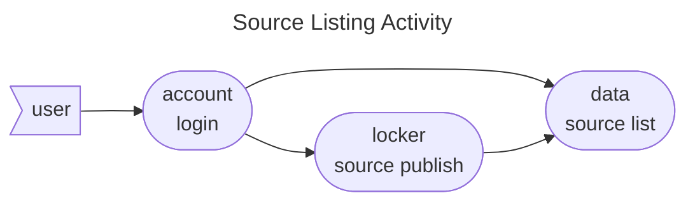

# Data Command Specs

The data command provides functionality for listing and archiving data sources and stores available to a specific
account on an Orchestration broker. Data sources and stores will typically be created using
the [Locker](../locker/index.md) command group and then will be used by the [Workspace](../workspace/index.md) group,
targeting individual flow nodes.

## Features

### Source Listing

The listing data source activity implies that the user is logged onto an account. It also should be validated with a
data source published from the [locker publish](../locker/index.md#data-source-publish) activity. It involves a series 
of scenarios detailed under [list account data sources](../../features/data/list_account_data_sources.feature).

## Commands

* [source](source.md)

## Test Cases

* [List Account Data Sources](../../features/data/list_account_data_sources.feature)
