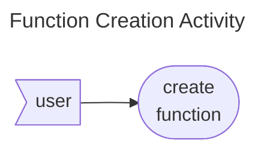
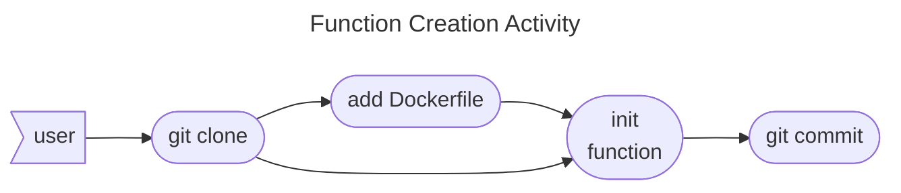
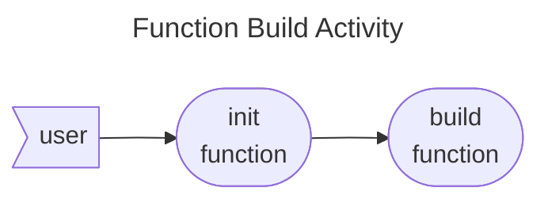
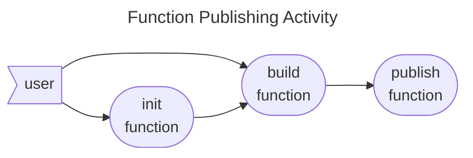

# Smart Function Command Specs

The function command provides functionality for creating, initializing, building and publish Smart Functions to the
GenAIz Orchestrated platform. It also provides means of running and testing the functions locally and managing their
runtime properties at large.

* [Features](#features)
    * [Function Creation](#function-creation)
    * [Function Initialization](#function-initialization)
    * [Function Build](#function-build)
    * [Function Publishing](#function-publishing)
* [Commands](#commands)
* [Test Cases](#test-cases)
* [Environment:](#environment)
* [Validation](#validation)

## Features

### Function Creation

The function creation activity is a simple user command which creates a function from scratch, using a folder or
creating a new one. Create does not allow overwriting a folder with a `Genaiz` configuration file already present. The
activity involves several scenarios detailed
under [Create bash example](../../features/function/create_bash_example.feature)
and [Create child connector](../../features/function/create_child_connector.feature).

### Function Initialization

The function initialization activity is a command used to initialize the values of an existing Function or functional
code that was already created. The activity requires the existence of a `Dockerfile` as all Smart Functions are
published within a Docker Image.

In terms of Git activity it can be visualized as:

### Function Build

The function building activity is pre-cursor to [Function Publishing](#function-publishing) and also to the more
complex [Solution Publishing](../solution/index.md#solution-publishing). Build will rely on the user's environment,
using the provided `Dockerfile` and the meta-data under the `Genaiz` configuration file, and package a `Docker Image` of
the Smart Function.

From the point of view of [Function Init](#function-initialization), it can be visualized as:

### Function Publishing

The Function Publishing activity can be invoked individually to fix potential issues in solution publishing, but also to
test Docker `registry` deployments in component tests. It involves several scenarios under test
cases [Publish bash example](../../features/function/publish_bash_example.feature)
and [Publish connector example](../../features/function/publish_bash_connector.feature).

## Commands

* [build](build.md)
* [create](create.md)
* [data](data.md)
* [init](init.md)
* [list](list.md)
* [prop](prop.md)
* [proxy](proxy.md)
* [publish](publish.md)
* [run](run.md)
* [start](start.md)
* [stop](stop.md)
* [test](test.md)

## Test Cases

* [Build bash example](../../features/function/build_bash_example.feature)
* [Create bash example](../../features/function/create_bash_example.feature)
* [Create child connector](../../features/function/create_child_connector.feature)
* [Data bash example](../../features/function/data_bash_example.feature)
* [Data source example](../../features/function/data_source_example.feature)
* [Data store example](../../features/function/data_store_example.feature)
* [Init empty example](../../features/function/init_empty_example.feature)
* [List bash example](../../features/function/list_bash_example.feature)
* [Prop bash connector](../../features/function/prop_bash_connector.feature)
* [Prop bash example](../../features/function/prop_bash_example.feature)
* [Proxy bash example](../../features/function/proxy_bash_example.feature)
* [Publish bash connector](../../features/function/publish_bash_connector.feature)
* [Publish bash example](../../features/function/publish_bash_example.feature)
* [Publish function validation](../../features/function/publish_function_validation.feature)
* [Publish unsynchronized example](../../features/function/publish_unsynchronized_example.feature)
* [Run bash example](../../features/function/run_bash_example.feature)
* [Start bash example](../../features/function/start_bash_example.feature)
* [Stop bash example](../../features/function/stop_bash_example.feature)
* [Test bash example](../../features/function/test_bash_example.feature)

## Environment:

The [run](run.md), [start](start.md) and [test](test.md) commands should normally honor the following environment
variables, forwarding them to the containers they create:

There should also be a mechanism for specifying environment variables using a .env file and be able to specify the path
of such file if it can not be found under the resolved Docker context.

### SF_INPUT_PATH

- default is /mnt/in
- this is the input path -- will be read-only -- each port defined in the SF has its own data-set

### SF_OUTPUT_PATH

- default is /mnt/out
- this is the output path -- read/write -- each port defined in the SF should target a directory here

### SF_LOG_PATH

- default is /mnt/log
- you can have separate log files for different purposes -- totally optional

### SF_VAR_PATH

- default is /mnt/var
- just like the unix directory /var, it's meant to be variables -- read/write

### SF_PROGRESS_FILE

- default is SF_VAR_PATH + "/progress"
- output a number between 0 and 100 and that progress will show up on the orchestrator (yes, validation exists) --
  totally optional

### SF_RESULT_FILE

- default is SF_VAR_PATH + "/result"
- simple result string -- it allows the workflow to use simple branch conditions -- totally optional

### SF_STATUS_FILE

- default is SF_VAR_PATH + "/status"
- status of the SF -- mandatory -- you need to write 'SUCCESS' in there before exiting, or else we consider that the
  function failed

### SF_TYPE

- the type of smart function (CONNECTOR or FUNCTION or TRIGGER)
- this should be provided by default by the SDK relying on the type field specified under the function publish
  configurations

## Validation

### FQDNV

See [Global Validation](../index.md#fqdnv)

### Handle and OEM

See [Global Validation](../index.md#handle-and-oem)

### Name

See [Global Validation](../index.md#name)

### Component

* A component is a string without white spaces which accepts letters, digits, dashes, dots and underscores.
* Components can not have 2 consecutive non-alphanumeric characters.
* Components must start with an alphanumeric character and end with an alphanumeric.

### Repository

* A repository is a combination of [Oem](#handle-and-oem), namespace components and a [Handle](#handle-and-oem).
* Only lower cases letters are accepted by registries, but the SDK will lower all upper case characters by default.
* Valid namespace components are in the same format as a handle, separated by a `/` character

### Type

* Must be either **FUNCTION**, **TRIGGER** or **CONNECTOR** in lower or upper case characters.

### Version

See [Global Validation](../index.md#version)
