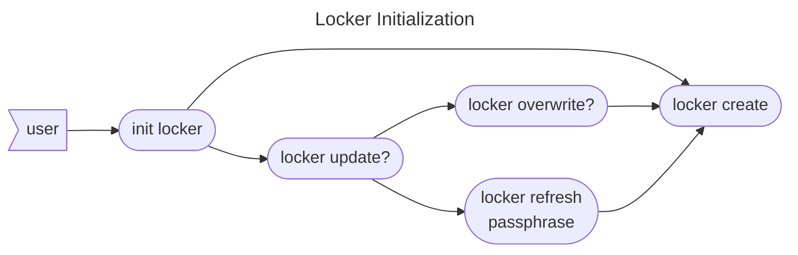
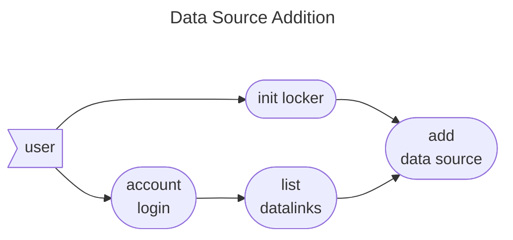
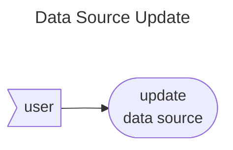
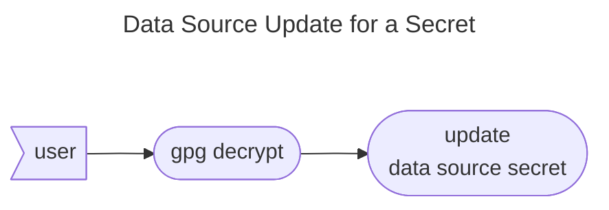
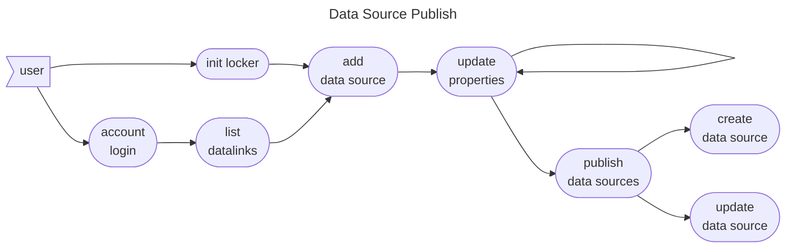

# Locker Command Specs

Locker is used as a command initiator for all commands use to manipulate data lockers. A data locker is a binary
encrypted file containing data source and store definitions. Locker files should always be treated
as black boxes. No properties from a locker file, secret or not, should ever be printed using the CLI.

Not all locker file interactions require usage of an account. All definitions, however are tied to
Orchestration [accounts](../account/index.md). To create a data source or a data store, the `locker` command will
require a valid [datalink](../datalink/index.md) from a session established beforehand.

* [Features](#features)
    * [Locker Initialization](#locker-initialization)
    * [Data Source Addition](#data-source-addition)
    * [Data Source Update](#data-source-update)
    * [Data Source Update for a Secret](#data-source-update-for-a-secret)
    * [Data Source Publish](#data-source-publish)
* [Test Cases](#test-cases)
* [Commands](#commands)
* [Validation](#validation)
    * [Passphrase](#passphrase)

## Features

### Locker Initialization

Locker initialization can be used to create a new locker file or to change the passphrase of an existing locker file.
The command will walk the user through STDIN if it finds an existing locker. When the user wants to refresh the
passphrase, the command will ask first the existing passphrase and second for a new passphrase.

### Data Source Addition

The data source addition activity is the localized update of an existing locker file. The activity requires a request
done to an Orchestration [Account](../account/index.md). A data source is always added for a
specific [Datalink](../datalink/index.md), which needs to be validated from the list of links available to the account
session.

### Data Source Update

The data source update activity is the localized update of an existing data source under an existing locker file. The
activity does not require a request to any [Account](../account/index.md), but still requires to know under which
account to look for a data source handle. The data sources already enshrined inside a locker are considered valid until
the [Data Source Publish](#data-source-publish) activity is invoked.

### Data Source Update for a Secret

The data source update activity above can not be used to update secret properties from text-based sources like the
command line. Secrets must live unencrypted for the shortest amount of time possible when an update or when
a [Data Source Publish](#data-source-publish) activity is performed. Secrets can only be read through
STDIN when the update command is invoked.

The recommended activity for updating a secret is as follows:

### Data Source Publish

Data source publishing is the final activity involving working with data sources with the objective of using the data
source with a user [workspace](../workspace/index.md). The activity implies that a data source which already exists can
be updated to new property values.

The user can perform any amount of updates with [data source update](#data-source-update)
or [data source secret update](#data-source-update-for-a-secret). When the publishing is invoked, the command will
determine if an update or a creation is necessary for it to complete the activity.

## Test Cases

* [Add data source to locker](../../features/locker/add_data_source_to_locker.feature)
* [Initialize locker](../../features/locker/init_locker.feature)
* [Publish data source to account](../../features/locker/publish_data_source_to_account.feature)
* [Update data source secret](../../features/locker/update_data_source_secret.feature)

## Commands

* [init](init.md)
* [source add](source.md#source-add)
* [source update](source.md#source-update)

## Validation

### Passphrase

* Passphrases need to be at least 8 characters long
* Required characters are capital and small letters, digits and special characters in the range of
  `!"#$%&'()*+,-./:;<=>?[\]^_{|}~`
