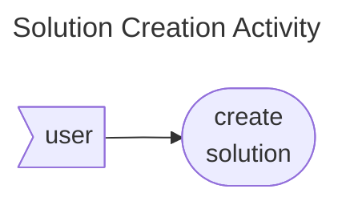
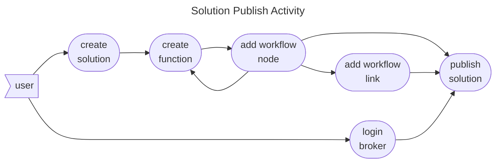

# Solution Command Specs

The solution command provides functionality for creating, listing and publishing solutions to a GenAIz orchestrated
broker. The solution is the work definition containment of a project. Typical deployments will have one solution for a
repository containing multiple functions.

* [Features](#features)
    * [Solution Creation](#solution-creation)
    * [Solution publishing](#solution-publishing)
* [Test Cases](#test-cases)
* [Commands](#commands)
* [Validation](#validation)

## Features

### Solution Creation

The solution creation activity is a simple user command which creates a solution under the specified folder. The command
can be invoked multiple times on the same folder acting both as a create and initialization procedures. The details of
such procedures can be found under [Create simple solution](../../features/function/create_bash_example.feature).

### Solution publishing

The solution publishing activity is a user command used to publish smart functions and their orchestrated workflow
definitions to a GenAIz orchestrated broker. It is a command with a complex pre-amble where the user needs to define at
least one Smart Function and one Workflow with at least one node.

The details are listed under scenarios provided
with [Publish simple solution](../../features/solution/publish_simple_solution.feature) and also
[Publish connector solution](../../features/solution/publish_connector_solution.feature) for additional complexity
using [DataLinks](../datalink/index.md).

## Test Cases

* [Create simple solution](../../features/solution/create_simple_solution.feature)
* [List account solutions](../../features/solution/list_account_solutions.feature)
* [List simple solutions](../../features/solution/list_simple_solutions.feature)
* [Publish connector solution](../../features/solution/publish_connector_solution.feature)
* [Publish simple solution](../../features/solution/publish_simple_solution.feature)
* [Publish workflow with props](../../features/solution/publish_workflow_with_props.feature)

## Commands

* [create](create.md)
* [list](list.md)
* [publish](publish.md)

## Validation

### Description

See [Global Validation](../index.md#description)

### Handle and OEM

See [Global Validation](../index.md#handle-and-oem)

### Name

See [Global Validation](../index.md#name)

### Version

See [Global Validation](../index.md#version)