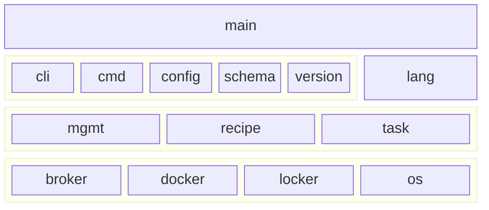

# GenAIz Package

* [Architecture](#architecture)
* [Makefile](#makefile)
* [Minimal Build](#minimal-build)
* [Commands](#commands)
    * [account (ac)](#account-ac)
    * [data (dt)](#data-dt)
    * [datalink (dk)](#datalink-dk)
    * [locker (lk)](#locker-lk)
    * [function (sf)](#function-sf)
    * [solution (sn)](#solution-sn)
    * [workflow (wf)](#workflow-wf)
    * [workspace (ws)](#workspace-ws)

## Architecture

The CLI architecture follows a pattern of integrations with the [Cobra](https://github.com/spf13/cobra)
and [Viper](https://github.com/spf13/viper) frameworks, popular with various GoLang projects. The architecture was
augmented with layers to decouple the spf13 framing from the actual task logic behind the commands.

There are several distinct layers in the code: The `cmd` layer, is where we use Cobra and Viper heavily. The `config`
layer contains merged framework bindings with configuration persistence functionality as a `Ledger`. The `task` layer
is where integrations with surrounding components is made. For instance: `docker`, `registry` and the GenAIz `broker`
itself. Finally, we use some form of shared layers in `mgmt` to factor common task executions, such as listing and
reading information.

Utility packages such as `cli`, `recipe` and `schema` provide utilitarian functionality shared to `cmd` or `task`.
`lang` is a generic catch-all for language enhancement constructs.

A rough layering can be seen below:



## Makefile

Building the project with its associated make file can install the application, its manual pages and associated
resources. To install locally:

```shell
cd genaiz && make all
```

To build a docker image of the sdk

```shell
cd genaiz && make docker
```

To execute tests alone or to get coverage metrics

```shell
cd genaiz && make coverage
```

For more information about all provided targets

```shell
cd genaiz && make help
```

## Minimal Build

```shell
cd genaiz
go build
./genaiz --help
```

## Commands

### account (ac)

The account module is used to manage account credentials and configuration policies with an Orchestrating Broker.

#### activate

The activate command allows a user to switch from one account session to another without necessarily having to
re-authorize an expired session.

When the command activates a session that is not

```shell
genaiz ac activate --help
genaiz ac activate dev.genaiz.com
```

#### inspect

The inspect command allows a process to confirm session credentials. This was added for CI/CD scripts.

```shell
genaiz ac inspect --help
genaiz ac inspect
```

#### list

The list command displays a tab delimited table of account sessions available to the CLI. It can also display the
results as a JSON list.

It can use an argument to apply basic filtering to the list:

```shell
genaiz ac list --help
genaiz ac list dev.genaiz.com
genaiz ac list dev.genaiz.com --json
```

#### login

The login command obtains an identity token from the specified Orchestrating Broker and registers the current active
account for a specified amount of time by the broker.

```shell
genaiz ac login dev.genaiz.com
```

#### logout

The logout command is invoked to explicitly remove a known session id from the local sdk configuration. The file is
found under $HOME/.cache/genaiz/.auth. The command will log out the active session by default is no --host parameter is
specified.

```shell
genaiz ac logout
```

### datalink (dk)

The datalink command is used to create, modify and publish datalink definitions to an Orchestration. The command
requires the **admin** role. Datalinks are definitions subject to instantiation on a per-user basis once the definition
is available.

The definition of a Datalink is the set of properties and secret properties used to establish a link. It is a parallel
to a Schema.

```shell
genaiz dk --help
```

#### create

Creates a datalink definition locally. Typically, this will write to `$HOME/.config/genaiz/Genaiz.yaml`. It creates an
empty and incomplete definition, which can be updated with the [prop](#prop) command group.

```shell
genaiz dk create --help
```

#### list

Listing datalinks is a command which can list datalinks associated with an account or the ones that are configured
locally.

```shell
genaiz dk list --help
```

#### prop

Prop is a command group for adding, editing and removing properties from a datalink definition.

```shell
genaiz dk prop --help
genaiz dk prop add --help
genaiz dk prop edit --help
genaiz dk prop rm --help
```

#### proxy

Proxy is a command group for adding and removing outbound proxies required by the datalink to function.

```shell
genaiz dk proxy --help
genaiz dk proxy add --help
genaiz dk proxy rm --help
```

#### publish

Publish is a command for publishing a local datalink to an admin account on an Orchestration broker.

```shell
genaiz dk publish --help
```

#### sync

Sync is a command for importing a datalink definition from an Orchestration broker to the local configuration file.

```shell
genaiz dk sync --help
```

### data (dt)

#### source

The data source command group is used to interact with data sources in a read only manner. It is the only way to view
properties, as lockers do not allow any displayed reads.

Currently, the CLI only allows listing data sources in generic fashion to allow usage with other commands.

```shell
genaiz dt --help
genaiz dt src --help
```

#### store

The data store command group is used to interact with data stores in a read only manner. It is the only way to view
properties, as lockers do not allow any displayed reads.

Currently, the CLI only allows listing data stores in generic fashion to allow usage with other commands.

```shell
genaiz dt --help
genaiz dt str --help
```

### locker (lk)

The locker command group is used to manage local locker files, required to be able to publish data sources and data
stores to an Orchestration broker.

Lockers are encrypted files, passphrase protected, which need to be opened when a command requiring a data source or
store is invoked.

```shell
genaiz lk --help
```

#### init

Initializing a locker is a necessary first step, but it is also can be used to change the passphrase used to encrypt
the file and the properties contained within.

```shell
genaiz lk init --help
```

#### source

Source is a command group allowing adding data source instances and updating the data source properties used to connect
a Smart Function and an external datalink.

```shell
genaiz lk source --help
genaiz lk source add --help
genaiz lk source publish --help
genaiz lk source update --help
```

#### store

Store is a command group allowing adding data store instances and updating the data store properties used to connect
a Smart Function and an external datalink.

```shell
genaiz lk store --help
genaiz lk store add --help
genaiz lk store publish --help
genaiz lk store update --help
```

### function (sf)

The function command group is used to manage smart functions and publish them as Docker images to an Orchestrating
Broker.

```shell
genaiz sf --help
```

#### build

Simply builds the Smart Function image. Build should always be called as part of other commands, except stop, if no
image with the Function definition can be found.

```shell
genaiz sf build --help
```

#### create

The command creates a new Smart Function folder with a typical layout. By default, the command will ask the user
interactively to confirm all initial values assigned to the function. The layout created should have a genaiz.yaml file
populated with the values passed to this command.

```shell
genaiz sf create --help
```

#### data

The data command group is used to manage several Smart Function components: input and output ports, outbound proxies,
data source, and data store requirements.

```shell
genaiz sf data --help
genaiz sf data input --help
genaiz sf data output --help
genaiz sf data proxy --help
genaiz sf data source --help
genaiz sf data store --help
```

#### init

The command initiates a new Smart Function under an existing folder. By default, the command will ask the user
interactively to confirm what it found under the folder, creating the genaiz.yaml file for the Smart Function.

```shell
genaiz sf init --help
```

#### list

The command lists all images with their versions belonging to Smart Function folder. In addition, it will list any local
containers configured with any of the listed images.

```shell
genaiz sf list --help
```

#### prop

The prop command allows management of property specifications for the Smart Function. Property specifications indicate
to runtime environments which environment variable the function expects.

```shell
genaiz sf prop --help
genaiz sf prop add --help
genaiz sf prop edit --help
genaiz sf prop env --help
genaiz sf prop rm --help
```

#### publish

The command initiates a session with the GenAIz broker retrieving authorization tokens to publish a Smart Function image
onto the GenAIz marketplace. This would require the user to be logged in using a **genaiz ac login** preamble to
retrieve licensing agreements.

```shell
genaiz sf publish --help
```

#### run

This should start the image with a disposable container in detached mode.

```shell
genaiz sf run --help
```

#### start

This should start the image with a named container, potentially replacing any existing one, and potentially disposing of
it after completion.

```shell
genaiz sf start --help
```

#### stop

This should stop a named container, potentially disposing of it after it exits.

```shell
genaiz sf stop --help
```

#### test

Similar to run, but starting a disposable container attached to the current shell.

```shell
genaiz sf test --help
```

### solution (sn)

The solution module allows a user to create a solution with a default workflow setting solution values which will be
used as default values for child components such as [workflows](#workflow-wf) and [functions](#function-sf).

#### create

Create initializes a new or an existing solution with the specified values. A solution must always have a workflow,
creating a solution implies creating a default workflow with default or specified values as well.

```shell
genaiz sn create --help
```

#### list

List is used to get list of solutions either from a local folder, from a specific account or from both ends.

```shell
genaiz sn list --help
```

#### publish

Publish is the command used to publish a Solution with its Workflows, and its local Smart Functions. The command will
iterate through all the Smart Functions found locally and invoke [genaiz sf publish](#publish)

```shell
genaiz sn publish --help
```

### workflow (wf)

The workflow module allows a user to create, add and remove workflow configurations from a solution file.

#### create

The create command takes an optional path, where a solution can be found, and adds a workflow to it. If no path is
supplied, the command reads the current working dir, if the path does not exist, it creates it. If the workflow already
exists an error is returned.

```shell
genaiz wf create --help
```

#### delete

The delete command removes a workflow from the current working dir solution. If the workflow does not exist, it returns
an error.

```shell
genaiz wf delete --help
```

#### links

The "links" commands can be used to add and remove links to and from an existing workflow. If the workflow does not
exist, it returns an error.

```shell
genaiz wf links --help
genaiz wf links add --help
genaiz wf links rm --help
```

#### nodes

The nodes commands can be used to add and remove nodes to and from an existing workflow. If the workflow does not
exist, it returns an error.

```shell
genaiz wf nodes --help
genaiz wf nodes add --help
genaiz wf nodes rm --help
```

#### prop

The prop command group is used to add or remove property values, or overrides on workflow nodes from the perspective of
their parent solution.

```shell
genaiz wf prop --help
genaiz wf prop add --help
genaiz wf prop edit --help
genaiz wf prop rm --help
```

### Workspace (ws)

The workspace module is used to create, list and manage workspaces with an associated account. A workspace is necessary
for being able to run workflows on a group of brokered agents.

#### create

The create command is a simple first step when configuring a workspace for an account.

```shell
genaiz ws create --help
```

#### flow

The flow sub-command group helps creating and managing workspace flows. These instances are necessary for
executing [solution workflows](#workflow-wf) on a given Orchestration broker.

```shell
genaiz ws flow --help
genaiz ws flow create --help
```

#### list

The list command serves an intermediary command for IDE displaying a list of available workspaces to the user. For
subsequent Account Management commands the list is used to instruct adding building blocks to an enclosing workspace.

```shell
genaiz ws list --help
```

#### node

The node command group allows individual nodes of workspace flows to be targeted to be able to configure data sets,
sources, stores and proxies.

```shell
genaiz ws node --help
genaiz ws node list --help
```
